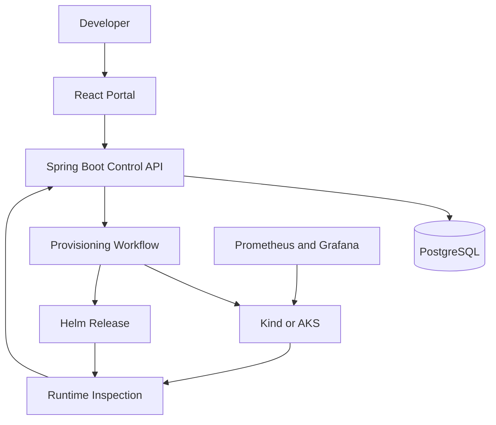

# EnvForge – Self-Service Kubernetes Sandbox Platform

EnvForge is a full-stack platform engineering application for creating, provisioning, monitoring, updating and cleaning up temporary Kubernetes environments.

The platform combines a React portal, a Spring Boot Control API, PostgreSQL, Kubernetes and Helm. Developers can request isolated sandbox environments without manually creating namespaces or deploying workloads.

The local reference environment runs on Kind, while the repository also demonstrates infrastructure-as-code, CI/CD, security and observability practices used in an Azure Kubernetes Service platform.

---

## Application Interface

The portal provides a responsive self-service interface where users can:

- create temporary Kubernetes environments;
- select an application template and image version;
- configure replicas, resource profiles and lifetime;
- follow provisioning states in real time;
- inspect live Kubernetes and Helm runtime information;
- retry failed provisioning after resolving the underlying problem;
- update deployed application versions;
- view deployment history and monitoring information.

---

## Features

### Environment Provisioning

- Self-service environment creation through the React portal
- REST API for environment and template operations
- PostgreSQL persistence with Flyway migrations
- Dedicated Kubernetes namespace for every environment
- Helm-based workload installation
- Lifecycle transitions:

```text
REQUESTED → PROVISIONING → DEPLOYING → READY
                                      ↘ FAILED
```

### Request Validation

- Kubernetes-compatible environment names
- Duplicate-name protection
- Template validation
- Replica and lifetime limits
- Semantic image-version validation using `major.minor.patch`
- Invalid requests rejected before database persistence or namespace creation

### Runtime Inspection

The portal retrieves live state from Kind through `kubectl` and Helm and displays:

- namespace existence;
- Helm release status;
- Deployment name;
- desired and ready replicas;
- Service name;
- runtime observation time;
- aggregated environment health.

### Provisioning Retry

- Retry is available only for environments in `FAILED` state
- The environment returns to `REQUESTED`
- A new provisioning event is published
- Helm attempts the deployment again
- Automatic portal polling follows the environment to `READY` or `FAILED`
- Invalid retry transitions return `409 Conflict`

### Kubernetes Isolation

- Namespace per environment
- Owner and management labels
- Expiration annotations
- ResourceQuota policies
- LimitRange policies
- Non-root application container
- Configurable resource profiles and replica counts

### Lifecycle and Deployments

- Application version updates
- Deployment history
- Environment expiration
- Manual and automatic cleanup workflows
- Kubernetes and Helm cleanup validation

### Observability

- Spring Boot Actuator endpoints
- Prometheus-compatible metrics
- Grafana dashboards
- Provisioning and workload health monitoring
- Incident and monitoring outage runbooks

### Security

- User identity integration
- Authorization and ownership checks
- Entra ID support
- Security-focused automated tests
- Kubernetes security context and resource policies

---

## System Architecture



### Provisioning Flow

1. The user submits the environment form.
2. The Control API validates the request.
3. The environment is stored in PostgreSQL with status `REQUESTED`.
4. EnvForge publishes a provisioning event.
5. The provisioner creates and labels the namespace.
6. Helm installs the selected workload template.
7. EnvForge waits for the Kubernetes Deployment.
8. The environment finishes in `READY` or `FAILED`.
9. The portal polls the API and displays the latest status.

---

## Tech Stack

| Component | Technology |
|---|---|
| Frontend | React, TypeScript, Vite, CSS |
| Backend API | Java 21, Spring Boot, Spring Data JPA |
| Validation | Jakarta Bean Validation |
| Database | PostgreSQL, Flyway |
| Containers | Docker |
| Orchestration | Kubernetes, Kind, AKS |
| Package management | Helm |
| Infrastructure as Code | Terraform |
| Cloud | Microsoft Azure, Azure Container Registry |
| Observability | Spring Boot Actuator, Prometheus, Grafana, Azure Monitor |
| Security | Spring Security, Microsoft Entra ID |
| CI/CD | GitHub Actions |
| Build tools | Maven Wrapper, npm |

---

## Project Structure

```text
envforge/
├── apps/
│   ├── cleanup-worker/       # Expired environment cleanup service
│   ├── control-api/          # Spring Boot platform API
│   ├── portal/               # React and TypeScript portal
│   ├── reliability-demo-api/ # Workload used for reliability tests
│   ├── static-web-demo/      # Static web workload and Docker image
│   └── traffic-generator/    # Python monitoring traffic generator
├── deployment/
│   ├── helm/
│   │   ├── envforge-monitoring/   # Monitoring integration chart
│   │   ├── envforge-platform/     # Control API, portal and PostgreSQL
│   │   ├── envforge-workload/     # Provisioned sandbox workload
│   │   └── reliability-demo-api/  # Reliability demo chart
│   └── kubernetes/
│       ├── examples/          # Example namespace policies
│       ├── local/             # Kind configuration and namespaces
│       ├── security/          # RBAC and NetworkPolicy manifests
│       └── traffic-generator/ # Traffic generator Deployment
├── infrastructure/
│   ├── bootstrap/            # Terraform remote-state bootstrap
│   ├── environments/dev/     # Development Azure environment
│   └── modules/              # ACR, AKS, identities, monitoring and network
├── observability/
│   ├── alerts/               # Prometheus alert rules
│   ├── dashboards/           # Grafana dashboard definitions
│   ├── grafana/provisioning/ # Grafana datasources and dashboards
│   ├── kubernetes/           # Kind monitoring stack values and rules
│   ├── prometheus/           # Prometheus configuration
│   └── scripts/              # Observability validation scripts
├── docs/
│   ├── architecture/         # Platform architecture and flows
│   ├── infrastructure/       # Azure and Terraform documentation
│   ├── lifecycle/            # Lifecycle design and weekly progress
│   ├── observability/        # Monitoring guides and incident runbooks
│   └── runbooks/             # End-to-end and operational runbooks
├── scripts/                  # Setup, smoke, lifecycle and Kind scripts
├── .github/
│   └── workflows/            # CI, security and E2E validation workflows
├── compose.yaml              # Local supporting services
├── CONTRIBUTING.md
└── README.md
```

---

## Running the Application Locally

### Prerequisites

- Java 21
- Node.js and npm
- Docker
- Kind
- `kubectl`
- Helm
- PostgreSQL through Docker Compose

### Recommended VS Code Extensions

When the repository is opened from WSL, install the relevant extensions in the `WSL: Ubuntu` profile, not only in the local Windows profile:

```bash
cd ~/projects/envforge
code .
```

Recommended extensions for this repository:

| Area | VS Code extensions |
|---|---|
| WSL | WSL |
| Java | Extension Pack for Java, Language Support for Java, Debugger for Java, Maven for Java, Test Runner for Java |
| Spring Boot | Spring Boot Extension Pack, Spring Boot Tools, Spring Boot Dashboard, Spring Initializr Java Support |
| Containers | Docker, Container Tools |
| Kubernetes | Kubernetes, YAML |
| Terraform | HashiCorp Terraform |
| GitHub | GitHub Actions |
| Frontend | ESLint, Prettier |
| API testing | REST Client |

### 1. Start PostgreSQL

```bash
docker compose up -d postgres
docker compose ps postgres
```

### 2. Verify the Kind cluster

```bash
kind get clusters
kubectl cluster-info --context kind-envforge
```

### 3. Build and load the demo image

```bash
docker build \
  --tag envforge/static-web-demo:0.2.0 \
  apps/static-web-demo

kind load docker-image \
  envforge/static-web-demo:0.2.0 \
  --name envforge
```

### 4. Start the Control API

```bash
cd apps/control-api

ENVFORGE_KUBE_CONTEXT=kind-envforge \
ENVFORGE_HELM_CHART_PATH="$(
  realpath ../../deployment/helm/envforge-workload
)" \
./mvnw spring-boot:run
```

The API is available at:

```text
http://localhost:8080
```

### 5. Start the portal

In another terminal:

```bash
cd apps/portal
npm ci
npm run dev
```

Open:

```text
http://localhost:5173
```

---

## Creating an Environment

Example portal values:

```text
Environment name: demo-web
Application template: Static Web App
Image version: 0.2.0
Replicas: 1
Resource profile: Small
Lifetime: 2 hours
Monitoring: enabled
```

The equivalent API request is:

```bash
curl --show-error \
  --fail-with-body \
  --request POST \
  --header 'Content-Type: application/json' \
  --data '{
    "name": "demo-web",
    "template": "STATIC_WEB",
    "imageVersion": "0.2.0",
    "replicas": 1,
    "resourceProfile": "SMALL",
    "lifetimeHours": 2,
    "monitoringEnabled": true
  }' \
  http://localhost:8080/api/environments \
  | jq .
```

---

## Useful Commands

List environments:

```bash
curl --silent http://localhost:8080/api/environments | jq .
```

Inspect Kubernetes resources:

```bash
kubectl get all --namespace env-demo-web
```

Inspect the Helm release:

```bash
helm status demo-web --namespace env-demo-web
```

Inspect runtime state:

```bash
ENVFORGE_ENVIRONMENT_ID="replace-with-environment-id"

curl --silent \
  "http://localhost:8080/api/environments/${ENVFORGE_ENVIRONMENT_ID}/runtime" \
  | jq .
```

Retry failed provisioning:

```bash
curl --show-error \
  --fail-with-body \
  --request POST \
  "http://localhost:8080/api/environments/${ENVFORGE_ENVIRONMENT_ID}/retry" \
  | jq .
```

---

## Testing and Validation

### Backend

PostgreSQL must be running before executing the complete test suite.

```bash
docker compose up -d postgres

cd apps/control-api
./mvnw test
```

### Portal

```bash
cd apps/portal
npm run lint
npm run build
```

### Helm

```bash
helm lint deployment/helm/envforge-workload
```

### Repository

```bash
git diff --check
git status
```

The repository also includes GitHub Actions workflows for Control API, portal, infrastructure, provisioning, lifecycle, security and observability validation.

---

## Documentation

- [Create an Environment](docs/create-an-environment.md)
- [Provisioning Troubleshooting](docs/provisioning-troubleshooting.md)
- Architecture documentation in `docs/architecture/`
- Lifecycle documentation in `docs/lifecycle/`
- Operational runbooks in `docs/runbooks/`
- Observability documentation in `docs/observability/`

---

## Important Notes

- Local provisioning requires Docker and the Kind cluster to be running.
- The complete backend test suite requires PostgreSQL on `localhost:5432`.
- Application images must be loaded into Kind or available from a configured registry.
- Image versions must follow `major.minor.patch` format.
- Provisioning can wait for up to two minutes for the Helm deployment.
- Retry is allowed only after an environment reaches `FAILED`.
- The local Kind implementation is the reference development environment.

---

## Project Demonstrates

- Platform engineering and developer self-service
- Full-stack development with React and Spring Boot
- Kubernetes namespace and workload automation
- Helm-based application deployment
- Infrastructure as Code with Terraform
- CI/CD with GitHub Actions
- Environment lifecycle management
- Identity, authorization and resource ownership
- Metrics, dashboards and incident troubleshooting
- Reliability testing and failure recovery

---

## Possible Extensions

- Production deployment to AKS
- Public environment URLs through Ingress and DNS
- Additional workload templates
- Asynchronous provisioning through a durable message broker
- Real-time status updates using Server-Sent Events or WebSockets
- Distributed tracing
- Cost reporting per environment
- Approval workflows for larger resource profiles
- Release versioning and automated changelog generation
