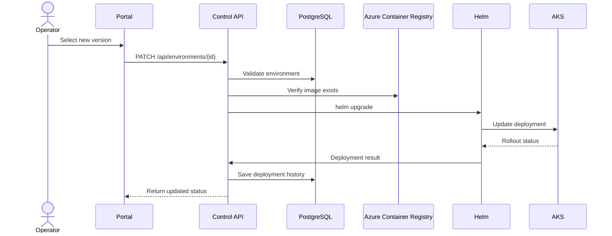

# Environment Deployment Flow

## Purpose

The deployment flow updates an existing environment to a newer application version.

## Input

The operator provides:

- environment id;
- target application version.

## Flow



## Generated values

Example request:

```json
{
  "environmentId": 1,
  "version": "1.1.0"
}
```

Generated values:

```text
Deployment revision: 5
Status: DEPLOYING
```

## Failure scenarios

- environment not found;
- invalid version;
- image not found in ACR;
- helm upgrade failed;
- rollout timeout;
- deployment cancelled.