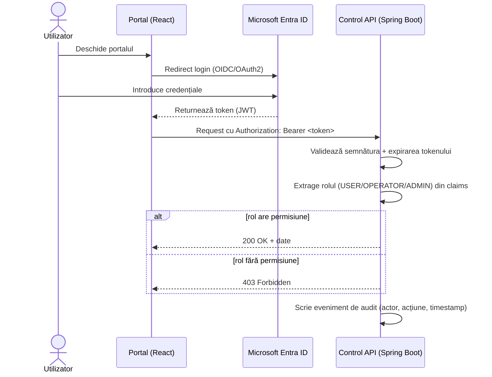
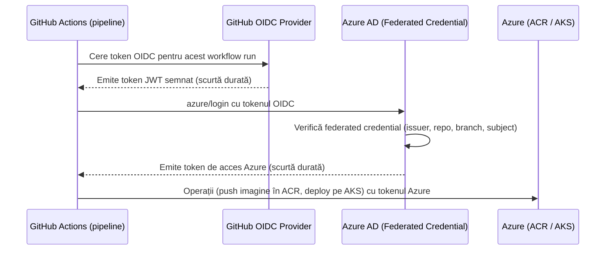

# Arhitectură Identity & Trust GitHub–Azure (envforge)

## 1. Flux de autentificare și autorizare (login)

Note:
- Tokenul JWT emis de Entra ID conține rolul/claims-urile necesare pentru autorizare.
- Control API nu stochează parole — validează doar tokenul primit.
- Fiecare acțiune sensibilă (update/delete/rollback) generează automat un eveniment de audit.

## 2. Trust GitHub Actions ↔ Azure (OIDC, fără secrete statice)

Note:
- Nu există client secret stocat în GitHub Secrets — trust-ul se bazează pe federated credential configurat în Azure AD, care are încredere doar în workflow-uri din repo-ul/branch-ul specificat.
- Fiecare token e temporar — reduce riscul în caz de scurgere de credențiale.
- Configurația se face în Terraform, modulul `identities` (Săptămâna 5), și se verifică accesul OIDC în Săptămâna 6.

## 3. Roluri și ce pot face

| Rol | Vizualizare medii | Update / Rollback | Gestionare useri/roluri | Vizualizare audit |
|---|---|---|---|---|
| USER | Da | Nu | Nu | Nu |
| OPERATOR | Da | Da | Nu | Nu |
| ADMIN | Da | Da | Da | Da |

## 4. Componente implicate

- **Portal (React)** — pagini Login, Profile, Audit.
- **Control API (Spring Boot)** — validare token, AuthorizationService, AuditService.
- **Microsoft Entra ID** — identity provider, emite tokenuri JWT.
- **Azure AD Federated Credentials** — trust OIDC pentru pipeline-uri GitHub Actions.
- **AKS / ACR** — resurse Azure accesate securizat de pipeline-uri, fără secrete statice.
