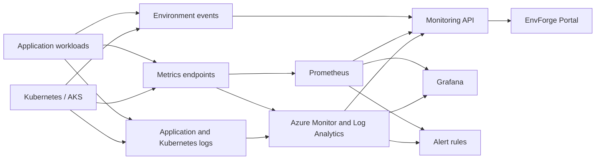

# Observability Architecture

## Overview

EnvForge collects telemetry from application workloads and Kubernetes resources. The collected metrics, logs and events are exposed through dashboards, APIs and alerting rules.

## Main telemetry

EnvForge will initially collect:

- CPU usage;
- memory usage;
- request rate;
- HTTP error rate;
- request latency;
- application health;
- Kubernetes pod restarts;
- environment events;
- deployment and failure events.

## Local development

The local observability environment will use:

- Spring Boot Actuator and Micrometer for application metrics;
- Prometheus for metric collection;
- Grafana for dashboards;
- Docker Compose for starting the monitoring services.

## Azure environment

The Azure deployment will later use:

- Azure Kubernetes Service;
- Azure Monitor;
- Log Analytics;
- Azure Managed Grafana or Grafana connected to Azure monitoring resources.
