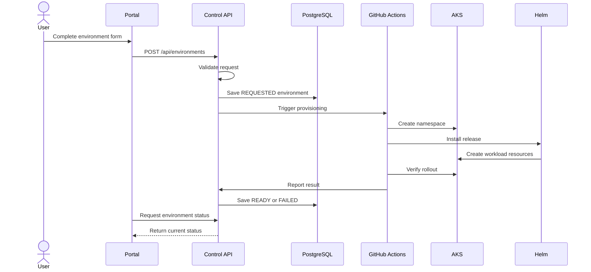

# Environment Provisioning Flow

## Purpose

The provisioning flow creates an isolated temporary Kubernetes environment from a request submitted through the EnvForge portal.

## Input

The user provides:

- environment name;
- application template;
- image version;
- replicas;
- resource profile;
- lifetime;
- monitoring preference.

## Flow



## Generated values

Example request:

```json
{
  "name": "static-demo-bogdan",
  "template": "STATIC_WEB",
  "imageVersion": "0.1.0",
  "replicas": 2,
  "resourceProfile": "SMALL",
  "lifetimeHours": 4,
  "monitoringEnabled": true
}
```

Generated values:

```text
Namespace: env-static-demo-bogdan
Helm release: static-demo-bogdan
Status: REQUESTED
```

## Failure scenarios

- invalid environment name;
- duplicate environment name;
- image does not exist;
- namespace already exists;
- Helm installation fails;
- rollout times out;
- smoke test fails;
- status callback fails.