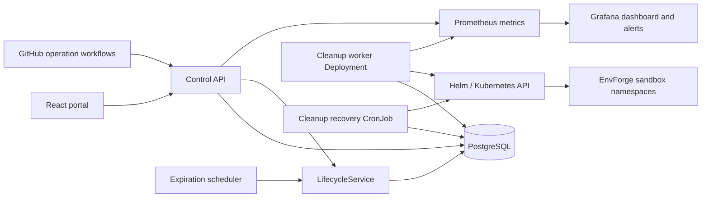

# Member 4 architecture

## Control API

Responsibilities:

- receives extension/delete/rollback requests;
- resolves current actor;
- applies ownership and state rules;
- creates lifecycle jobs;
- exposes environment and audit information;
- detects expiration through the scheduler.

It does not directly execute Helm or kubectl.

## PostgreSQL

Stores:

- environment lifecycle status;
- expiration/deletion timestamps;
- Helm revisions;
- asynchronous lifecycle jobs;
- audit history;
- concurrency version.

The active-job partial unique index prevents simultaneous lifecycle operations for one environment.

## Cleanup worker

Responsibilities:

- claims queued jobs using `FOR UPDATE SKIP LOCKED`;
- executes delete/rollback in `SIMULATED` or `REAL`;
- applies timeout and bounded retries;
- verifies cleanup;
- updates final status and audit;
- exposes operation metrics.

## Kubernetes model

- persistent worker Deployment: continuous processing and scrapeable metrics;
- recovery CronJob: periodic one-shot sweep;
- ServiceAccount: worker identity;
- reusable ClusterRole: bound only inside EnvForge sandbox namespaces;
- optional cluster-scoped namespace deletion, disabled by default.

## Security boundaries

- local header identity is a demo adapter only;
- production identity comes from Entra/JWT;
- users operate on their own environments;
- rollback requires operator/admin;
- system actor is internal only;
- destructive GitHub workflows use protected environments;
- worker starts in simulated mode.
