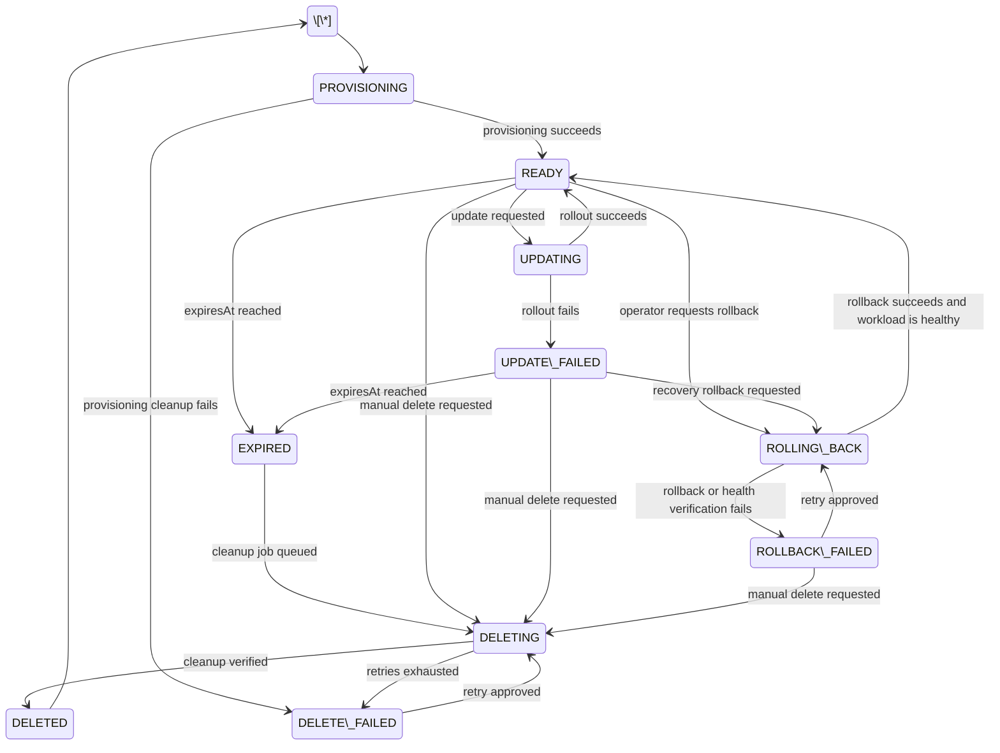

# EnvForge Lifecycle State Machine

## Proposed states

|Status|Meaning|
|-|-|
|`PROVISIONING`|Environment creation is in progress.|
|`READY`|Environment is healthy and usable.|
|`UPDATING`|A new image or application version is being deployed.|
|`UPDATE\\\_FAILED`|The latest rollout failed.|
|`ROLLING\\\_BACK`|Helm is restoring a previous revision.|
|`ROLLBACK\\\_FAILED`|Rollback or post-rollback health verification failed.|
|`EXPIRED`|The configured lifetime ended and cleanup was requested.|
|`DELETING`|Cleanup is currently being executed.|
|`DELETE\\\_FAILED`|Cleanup did not finish after the configured retry attempts.|
|`DELETED`|Cleanup was verified and the environment is no longer active.|

## State diagram



## Lifecycle rules

* Only one active lifecycle operation is allowed for one environment.
* Delete and rollback cannot run simultaneously.
* Two delete operations cannot run simultaneously.
* Two rollback operations cannot run simultaneously.
* `DELETED` is a terminal state.
* A deleted environment cannot be extended, updated or rolled back.
* Rollback requires an earlier valid Helm revision.
* Automatic expiration is allowed from `READY` and `UPDATE\\\_FAILED`.
* `DELETED` is assigned only after Helm and Kubernetes cleanup verification.
* Failed operations are retried only up to the configured maximum.
* Every request, retry, success and final failure creates an audit event.
* An environment in `DELETING` cannot be updated or rolled back.
* Status changes must be performed through lifecycle services, not by direct database changes.

## Allowed transitions

|Current status|Operation|Next status|
|-|-|-|
|`PROVISIONING`|Provisioning succeeds|`READY`|
|`PROVISIONING`|Provisioning cleanup fails|`DELETE\\\_FAILED`|
|`READY`|Update requested|`UPDATING`|
|`UPDATING`|Rollout succeeds|`READY`|
|`UPDATING`|Rollout fails|`UPDATE\\\_FAILED`|
|`READY`|Rollback requested|`ROLLING\\\_BACK`|
|`UPDATE\\\_FAILED`|Rollback requested|`ROLLING\\\_BACK`|
|`ROLLING\\\_BACK`|Rollback succeeds|`READY`|
|`ROLLING\\\_BACK`|Rollback fails|`ROLLBACK\\\_FAILED`|
|`ROLLBACK\\\_FAILED`|Retry rollback|`ROLLING\\\_BACK`|
|`READY`|Expiration reached|`EXPIRED`|
|`UPDATE\\\_FAILED`|Expiration reached|`EXPIRED`|
|`EXPIRED`|Cleanup queued|`DELETING`|
|`READY`|Manual delete|`DELETING`|
|`UPDATE\\\_FAILED`|Manual delete|`DELETING`|
|`ROLLBACK\\\_FAILED`|Manual delete|`DELETING`|
|`DELETING`|Cleanup succeeds|`DELETED`|
|`DELETING`|Cleanup fails permanently|`DELETE\\\_FAILED`|
|`DELETE\\\_FAILED`|Retry cleanup|`DELETING`|

## Invalid transitions

The following operations must be rejected:

* `DELETED` to any active state;
* `DELETING` to `UPDATING`;
* `DELETING` to `ROLLING\\\_BACK`;
* `ROLLING\\\_BACK` to `UPDATING`;
* rollback without a valid previous Helm revision;
* lifetime extension for `DELETING` or `DELETED`;
* a second lifecycle operation while another active job exists;
* manual status changes that bypass the lifecycle service.

The API should return `409 Conflict` for invalid or concurrent lifecycle operations.

## Status ownership

|Status or transition|Responsible component|
|-|-|
|`PROVISIONING` to `READY`|Environment provisioning service|
|`READY` to `UPDATING`|Deployment service|
|`UPDATING` to `READY`|Deployment service|
|`UPDATING` to `UPDATE\\\_FAILED`|Deployment service|
|`READY` or `UPDATE\\\_FAILED` to `ROLLING\\\_BACK`|Lifecycle service|
|`ROLLING\\\_BACK` to `READY`|Cleanup worker or deployment executor|
|`ROLLING\\\_BACK` to `ROLLBACK\\\_FAILED`|Cleanup worker or deployment executor|
|`READY` or `UPDATE\\\_FAILED` to `EXPIRED`|Expiration scheduler|
|`EXPIRED` to `DELETING`|Lifecycle service|
|`READY` to `DELETING`|Lifecycle service|
|`DELETING` to `DELETED`|Cleanup worker|
|`DELETING` to `DELETE\\\_FAILED`|Cleanup worker|

## Concurrency rules

* Only one active lifecycle job may exist for one environment.
* Lifecycle requests must lock or version the environment before changing status.
* Workers must not process the same job simultaneously.
* Duplicate delete requests must be idempotent or return `409 Conflict`.
* Stale `RUNNING` jobs must be detected and recovered.
* Retry attempts must not create a second active job.

Possible implementation mechanisms:

* database unique constraint for active jobs;
* optimistic locking using a version field;
* pessimistic row locking;
* `FOR UPDATE SKIP LOCKED` for worker job claiming.

## Expiration behavior

`EXPIRED` means that the configured lifetime ended, but cleanup may still be pending.

Expected flow:

```text
READY -> EXPIRED -> DELETING -> DELETED
```

The scheduler should:

1. find environments where `expiresAt` is in the past;
2. ignore environments already being processed;
3. set the actor to `SYSTEM`;
4. create a cleanup job;
5. record expiration in audit;
6. continue processing other environments if one operation fails.

## Delete behavior

```text
Delete request
-> authorization and ownership validation
-> transition to DELETING
-> cleanup job creation
-> helm uninstall
-> Kubernetes resource verification
-> DELETED or DELETE\\\_FAILED
```

The environment must not be marked `DELETED` only because the command returned successfully. The worker must verify that the expected resources were removed.

## Rollback behavior

```text
Rollback request
-> authorization validation
-> Helm revision validation
-> transition to ROLLING\\\_BACK
-> helm rollback
-> rollout health verification
-> READY or ROLLBACK\\\_FAILED
```

Rollback should store:

* requested revision;
* previous revision;
* resulting revision;
* actor;
* operation result;
* failure details, when applicable.

## Retry and failure behavior

For temporary failures, the platform should use bounded retries.

Final statuses:

* `DELETE\\\_FAILED`
* `ROLLBACK\\\_FAILED`

Each retry should update:

* attempt count;
* last error;
* next retry time;
* audit history.

## Audit requirements

Each lifecycle event should contain:

|Field|Description|
|-|-|
|`environmentId`|Target environment|
|`actorId`|User, operator, administrator or `SYSTEM`|
|`action`|Expiration, delete, rollback, retry or extension|
|`previousStatus`|Status before the operation|
|`newStatus`|Status after the operation|
|`result`|Requested, running, successful, failed or retrying|
|`details`|Revision, error or cleanup information|
|`createdAt`|UTC event timestamp|

## Team decisions

Before implementation or merge, the team must confirm:

1. Is `EXPIRED` visible in the portal or immediately changed to `DELETING`?
2. Can a delete operation interrupt an update?
3. Can expiration start while an update or rollback is active?
4. Which component owns `UPDATING` and `UPDATE\\\_FAILED`?
5. Which component executes the actual Helm rollback?
6. Does rollback always use the last successful revision?
7. Can an operator select a specific revision?
8. Does deleting a sandbox remove the entire namespace or only the Helm release?
9. How is an EnvForge-owned namespace identified?
10. How are stale `RUNNING` jobs recovered?
11. How many retry attempts are allowed?
12. Who can extend the lifetime?
13. Who can delete an environment?
14. Who can execute rollback?
15. How long is lifecycle audit data retained?

